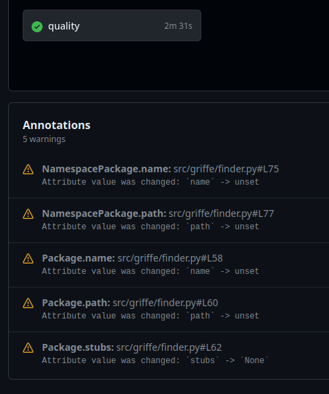

# Checking APIs

Griffe is able to compare two snapshots of your project to detect API breakages between the old and the new snapshot. By snapshot we mean a specific point in your Git history. For example, you can ask Griffe to compare your current code against a specific tag.

## Command-line

### Using Git

By default, Griffe will compare the current code to the latest tag:

```console
$ griffe check mypackage
```

To specify another Git reference to check against, use the `--against` or `-a` option:

```console
$ griffe check mypackage -a 0.2.0
```

You can specify a Git tag, commit (hash), or even a branch: Griffe will create a worktree at this reference in a temporary directory, and clean it up after finishing.

If you want to also specify the *base* reference to use (instead of the current code), use the `--base` or `-b` option. Some examples:

```console
$ griffe check mypackage -b HEAD -a 2.0.0
$ griffe check mypackage -b 2.0.0 -a 1.0.0
$ griffe check mypackage -b fix-issue-90 -a 1.2.3 
$ griffe check mypackage -b 8afcfd6e 
```

TIP: **Important:** Remember that the base is the most recent reference, and the one we compare it against is the oldest one.

The package name you pass to `griffe check` must be found relatively to the repository root. For Griffe to find packages in subfolders, pass the parent subfolder to the `--search` or `-s` option. Example for `src`-layouts:

```console
$ griffe check -s src griffe
```

Example in a monorepo, within a deeper file tree:

```console
$ griffe check -s back/services/identity-provider/src identity_provider
```

### Using PyPI

[:octicons-heart-fill-24:{ .pulse } Sponsors only](../../insiders/index.md){ .insiders } — [:octicons-tag-24: Insiders 1.1.0](../../insiders/changelog.md#1.1.0)

It's also possible to directly **check packages from PyPI.org** (or other indexes configured through `PIP_INDEX_URL`). This feature is [available to sponsors only](../../insiders/index.md) and requires that you install Griffe with the `pypi` extra:

```console
$ pip install griffe[pypi]
```

The command syntax is:

```console
$ griffe check package_name -b project-name==2.0 -a project-name==1.0
```

You can let Griffe guess the package name by passing an empty string:

```console
$ griffe check "" -b project-name==2.0 -a project-name==1.0
```

[PEP 508 version specifiers](https://peps.python.org/pep-0508/) are supported (`<`, `<=`, `!=`, `==`, `>=`, `>`, `~=`). For example, to compare v2 against the version just before it:

```console
$ griffe check "" -b project-name==2.0 -a project-name<2.0
```

Without a version specifier on the base reference, or without a base reference at all, Griffe will use the latest available version. The two following commands compare the latest version against v1:

```console
$ griffe check "" -b project-name -a project-name==1.0
$ griffe check "" -a project-name==1.0
```

Griffe will actually install packages in a cache directory. It means a few things: source distributions are supported, and only packages that are compatible with your current environment can be checked.

## Python API

To programmatically check for API breaking changes, you have to load two snapshots of your code base, for example using our [`load_git()`][griffe.load_git] utility, and then passing them both to the [`find_breaking_changes()`][griffe.find_breaking_changes] function. This function will yield instances of [`Breakage`][griffe.Breakage]. It's up to you how you want to use these breakage instances.

```python
import griffe

my_pkg_v1 = griffe.load_git("my_pkg", ref="v1")
my_pkg_v2 = griffe.load_git("my_pkg", ref="v2")

for breaking_change in find_breaking_changes(my_pkg_v1, my_pkg_v2):
    print(breaking_change.explain())
```

## In CI

It is of course possible to Griffe in CI (Continuous Integration) to make sure no breaking changes are introduced in pull/merge requests.

### GitHub {#ci-github}

Here is a quick example on how to use Griffe in a GitHub workflow:

```yaml
jobs:
  check-api:
    runs-on: ubuntu-latest
    steps:
    - uses: actions/checkout@v4
    
    # Griffe requires that Git tags are available.
    - run: git fetch --depth=1 --tags
    
    - uses: actions/setup-python@v5
      with:
        python-version: "3.11"

    # Install Griffe (use your preferred dependency manager).
    - run: pip install griffe

    - run: griffe check -ssrc your_package
```

The last step will fail the workflow if any breaking change is found. If you are part of [Insiders](../../insiders/index.md), you can format the output for GitHub, to enjoy GitHub annotations in PRs. See [GitHub format](#github) below.

## Detected breakages

In this section, we will describe the breakages that Griffe detects, giving some code examples and hints on how to properly communicate breakages with deprecation messages before actually releasing them.

Obviously, these explanations and the value of the hints we provide depend on your definition of what is a public Python API. There is no clear and generally agreed upon definition of "public Python API". A public Python API might vary from one project to another. In essence, your public API is what you say it is.

However, we do have conventions like prefixing objects with an underscore to tell users these objects are part of the private API, or internals, and therefore should not be used. For the rest, Griffe can detect changes that *will* trigger immediate errors in your users code', and changes that *might* cause issues in your users' code. Although the latter sound less impactful, they do have a serious impact, because they can *silently* change the behavior of your users' code, leading to issues that are hard to detect, understand and fix.

[Knowing that every change is a breaking change](https://xkcd.com/1172/), the more we detect and document (potentially) breaking changes in our changelogs, the better.

### Parameter moved

> Positional parameter was moved.

Moving the order of positional parameters can *silently* break your users' code.

```python title="before"
# your code
def greet(prefix, name):
    print(prefix + " " + name)

# user's code
greet("hello", "world")
```

```python title="after"
# your code
def greet(name, prefix):
    print(prefix + " " + name)

# user's code: no immediate error, broken behavior
greet("hello", "world")
```

NOTE: Moving required parameters around is not really an API breakage, depending on our definition of API, since this won't raise immediate errors like `TypeError`. The function expects a number of arguments, and the developer pass it this same number of arguments: the contract is fulfilled. But parameters very often have specific meaning, and changing their order will *silently lead* (no immediate error) to incorrect behavior, potentially making it difficult to detect, understand and fix the issue. That is why it is important to warn developers about such changes.

> TIP: **Hint**  
> If you often add, move or remove parameters, consider making them keyword-only, so that their order doesn't matter.
>
> ```python title="before"
> def greet(*, prefix, name):
>     print(prefix + " " + name)
>
> greet(prefix="hello", name="world")
> ```
>
> ```python title="after"
> def greet(*, name, prefix):
>     print(prefix + " " + name)
>
> # still working as expected
> greet(prefix="hello", name="world")
> ```

### Parameter removed

> Parameter was removed.

Removing a parameter can immediately break your users' code.

```python title="before"
# your code
def greet(prefix, name):
    print(prefix + " " + name)

# user's code
greet("hello", "world")
```

```python title="after"
# your code
def greet(name):
    print("hello " + name)

# user's code: immediate error
greet("hello", "world")

# even with keyword parameters: immediate error
greet(prefix="hello", name="world")
```

> TIP: **Hint**  
> Allow a deprecation period for the removed parameter by swallowing it in a variadic positional parameter, a variadic keyword parameter, or both.
>
> === "positional-only"
>     ```python title="before"
>     # your parameters are positional-only parameters (difficult deprecation)
>     def greet(prefix, name, /):
>         print(prefix + " " + name)
>
>     greet("hello", "world")
>     ```
>
>     ```python title="after"
>     # swallow prefix using a variadic positional parameter
>     def greet(*args):
>         if len(args) == 2:
>             prefix, name = args
>         elif len(args) == 1:
>             prefix = None
>             name = args[0]
>         else:
>             raise ValueError("missing parameter 'name'")
>         if prefix is not None:
>             warnings.warn(DeprecationWarning, "prefix is deprecated")
>         print("hello " + name)
>
>     # still working as expected
>     greet("hello", "world")
>     ```
>
> === "keyword-only"
>     ```python title="before"
>     # your parameters are keyword-only parameters (easy deprecation)
>     def greet(*, prefix, name):
>         print(prefix + " " + name)
>
>     greet(prefix="hello", name="world")
>     ```
>
>     ```python title="after"
>     # swallow prefix using a variadic keyword parameter
>     def greet(name, **kwargs):
>         prefix = kwargs.get("prefix", None)
>         if prefix is not None:
>             warnings.warn(DeprecationWarning, "prefix is deprecated")
>         print("hello " + name)
>
>     # still working as expected
>     greet(prefix="hello", name="world")
>     ```
>
> === "positional or keyword"
>     ```python title="before"
>     # your parameters are positional or keyword parameters (very difficult deprecation)
>     def greet(prefix, name):
>         print(prefix + " " + name)
>
>     greet("hello", name="world")
>     ```
>
>     ```python title="after"
>     # no other choice than swallowing both forms...
>     # ignoring the deprecated parameter becomes quite complex
>     def greet(*args, **kwargs):
>         if len(args) == 2:
>             prefix, name = args
>         elif len(args) == 1:
>             prefix = None
>             name = args[0]
>         if "name" in kwargs:
>             name = kwargs["name"]
>         if "prefix" in kwargs:
>             prefix = kwargs["prefix"]
>         if prefix is not None:
>             warnings.warn(DeprecationWarning, "prefix is deprecated")
>         print("hello " + name)
>
>     # still working as expected
>     greet("hello", "world")
>     greet("hello", name="world")
>     greet(prefix="hello", name="world")
>     ```

### Parameter changed kind

> Parameter kind was changed

Changing the kind of a parameter to another (positional-only, keyword-only, positional or keyword, variadic positional, variadic keyword) can immediately break your users' code.

```python title="before"
# your code
def greet(name):
    print("hello " + name)

def greet2(name):
    print("hello " + name)

# user's code: all working fine
greet("tim")
greet(name="tim")
greet2("tim")
greet2(name="tim")
```

```python title="after"
# your code
def greet(name, /):
    print("hello " + name)

def greet2(*, name):
    print("hello " + name)

# user's code: working as expected
greet("tim")
greet2(name="tim")

# immediate error
greet(name="tim")
greet2("tim")
```

> TIP: **Hint**  
> Although it actually is a breaking change, changing your positional or keyword parameters' kind to keyword-only makes your public function more robust to future changes (forward-compatibility).
>
> For functions with lots of optional parameters, and a few (one or two) required parameters, it can be a good idea to accept the required parameters as positional or keyword, while accepting the optional parameters as keyword-only parameters:
>
> ```python
> def greet(name, *, punctuation=False, bold=False, italic=False):
>     ...
>
> # simple cases are easy to write
> greet("tim")
> greet("tiff")
>
> # complex cases are never ambiguous
> greet("tim", italic=True, bold=True)
> greet(name="tiff", bold=True, punctuation=True)
> ```
>
> Positional-only parameters are useful in some specific cases, such as when a function takes two or more numeric values, and their order does not matter, and naming the parameters would not make sense:
>
> ```python
> def multiply3(a, b, c, /):
>     return a * b * c
>
> # all the following are equivalent
> multiply3(4, 2, 3)
> multiply3(4, 3, 2)
> multiply3(2, 3, 4)
> # etc.
> ```

### Parameter changed default

> Parameter default was changed

Changing the default value of a parameter can *silently* break your users' code.

```python title="before"
# your code
def compute_something(value: int, to_float=True):
    value = ...
    if to_float:
        return float(value)
    return value

# user's code: condition is entered
if isinstance(compute_something(7), float):
    ...
```

```python title="after"
# your code
def compute_something(value: int, to_float=False):
    value = ...
    if to_float:
        return float(value)
    return value

# user's code: condition is not entered anymore
if isinstance(compute_something(7), float):
    ...
```

NOTE: Changing default value of parameters is not really an API breakage, depending on our definition of API, since this won't raise immediate errors like `TypeError`. Not using the parameter still provides the argument with a default value: the contract is fulfilled. But default values very often have specific meaning, and changing them will *silently lead* (no immediate error) to incorrect behavior, potentially making it difficult to detect, understand and fix the issue. That is why it is important to warn developers about such changes.

> TIP: **Hint**  
> Allow a deprecation period for the old default value by using a sentinel value to detect when the parameter wasn't used by the user:
>
> ```python title="in the coming release"
> _sentinel = object()
>
> def compute_something(value: int, to_float=_sentinel):
>     value = ...
>     if to_float is _sentinel:
>         to_float = True
>         warnings.warn(
>             DeprecationWarning,
>             "default value of 'to_float' will change from True to False, "
>             "please provide 'to_float=True' if you want to retain the current behavior"
>         )
>     if to_float:
>         return float(value)
>     return value
> ```
>
> In a later release you can remove the sentinel, the deprecation warning, and set `False` as default to `to_float`.
>
> ```python title="in a later release"
> def compute_something(value: int, to_float=False):
>     value = ...
>     if to_float:
>         return float(value)
>     return value
> ```

### Parameter changed required

> Parameter is now required

Changing an optional parameter to a required one (by removing its default value) can immediately break your users' code.

```python title="before"
# your code
def greet(name, prefix="hello"):
    print(prefix + " " + name)

# user's code
greet("tiff")
```

```python title="after"
# your code
def greet(name, prefix):
    print(prefix + " " + name)

# user's code: immediate error
greet("tiff")
```

> TIP: **Hint**  
> Allow a deprecation period for the default value by using a sentinel value to detect when the parameter wasn't used by the user:
>
> ```python title="in the coming release"
> _sentinel = object()
>
> def greet(name, prefix=_sentinel):
>     if prefix is _sentinel:
>         prefix = "hello"
>         warnings.warn(DeprecationWarning, "'prefix' will become required in the next release")
>     print(prefix + " " + name)
> ```
>
> In a later release you can remove the sentinel, the deprecation warning, and the default value of `prefix`.
>
> ```python title="in a later release"
> def greet(name, prefix):
>     print(prefix + " " + name)
> ```

### Parameter added required

> Parameter was added as required

Adding a new, required parameter can immediately break your users' code.

```python title="before"
# your code
def greet(name):
    print("hello " + name)

# user's code
greet("tiff")
```

```python title="after"
# your code
def greet(name, prefix):
    print(prefix + " " + name)

# user's code: immediate error
greet("tiff")
```

> TIP: **Hint**  
> You can delay (or avoid) and inform your users about the upcoming breakage by temporarily (or permanently) providing a default value for the new parameter:
>
> ```python title="in the coming release"
> def greet(name, prefix="hello"):
>     print(prefix + " " + name)
> ```

### Return changed type

> Return types are incompatible

WARNING: **Not yet supported!** Telling if a type construct is compatible with another one is not trivial, especially statically. Support for this will be implemented later.

### Object removed

> Public object was removed

Removing a public object from a module can immediately break your users' code.

```python title="before"
# your/module.py
special_thing = "hey"

# user/module.py
from your.module import special_thing

# other/user/module.py
from your import module
print(module.special_thing)
```

```python title="after"
# user/module.py: import error
from your.module import special_thing

# other/user/module.py: attribute error
from your import module
print(module.special_thing)
```

> TIP: **Hint**  
> Allow a deprecation period by declaring a module-level `__getattr__` function that returns the given object while warning about its deprecation:
>
> ```python
> def __getattr__(name):
>     if name == "special_thing":
>         warnings.warn(DeprecationWarning, "'special_thing' is deprecated and will be removed")
>         return "hey"
> ```

### Object changed kind

> Public object points to a different kind of object

Changing the kind (attribute, function, class, module) of a public object can *silently* break your users' code.

```python title="before"
# your code
class Factory:
    def __call__(self, ...):
        ...

factory = Factory(...)

# user's code: condition is entered
if isinstance(factory, Factory):
    ...
```

```python title="after"
# your code
class Factory:
    ...

def factory(...):
    ...

# user's code: condition is not entered anymore
if isinstance(factory, Factory):
    ...
```

NOTE: Changing the kind of an object is not really an API breakage, depending on our definition of API, since this won't always raise immediate errors like `TypeError`. The object is still here and accessed: the contract is fulfilled. But developers sometimes rely on the kind of an object, so changing it will lead to incorrect behavior, potentially making it difficult to detect, understand and fix the issue. That is why it is important to warn developers about such changes.

### Attribute changed type

> Attribute types are incompatible

WARNING: **Not yet supported!** Telling if a type construct is compatible with another one is not trivial, especially statically. Support for this will be implemented later.

### Attribute changed value

> Attribute value was changed

Changing the value of an attribute can *silently* break your users' code.

```python title="before"
# your code
PY_VERSION = os.getenv("PY_VERSION")

# user's code: condition is entered
if PY_VERSION is None:
    ...
```

```python title="after"
# your code
PY_VERSION = os.getenv("PY_VERSION", "3.8")

# user's code: condition is not entered anymore
if PY_VERSION is None:
    ...
```

NOTE: Changing the value of an attribute is not really an API breakage, depending on our definition of API, since this won't raise immediate errors like `TypeError`. The attribute is still here and accessed: the contract is fulfilled. But developers heavily rely on the value of public attributes, so changing it will lead to incorrect behavior, potentially making it difficult to detect, understand and fix the issue. That is why it is important to warn developers about such changes.

TIP: **Hint**  
Make sure to document the change of value of the attribute in your changelog, particularly the previous and new range of values it can take.

### Class removed base

> Base class was removed

Removing a class from another class' bases can *silently* break your users' code.

```python title="before"
# your code
class A: ...
class B: ...
class C(A, B): ...

# user's code: condition is entered
if B in klass.__bases__:
    ...
```

```python title="after"
# your code
class A: ...
class B: ...
class C(A): ...

# user's code: condition is not entered anymore
if B in klass.__bases__:
    ...
```

NOTE: Unless inherited members are lost in the process, removing a class base is not really an API breakage, depending on our definition of API, since this won't raise immediate errors like `TypeError`. The class is here, its members as well: the contract is fulfilled. But developers sometimes rely on the actual bases of a class, so changing them will lead to incorrect behavior, potentially making it difficult to detect, understand and fix the issue. That is why it is important to warn developers about such changes.

## Output style

Griffe supports writing detected breakages in multiple formats, or styles.

[](){#format-oneline}
### One-line

- **CLI**: `-f oneline` / no flags
- **API**: `check(...)` / `check(..., style="oneline")` / `check(..., style=ExplanationStyle.ONE_LINE)`

This is the default format. Griffe will print each detected breakage on a single line:

```console exec="1" source="console" result="ansi" returncode="1"
$ export FORCE_COLOR=1  # markdown-exec: hide
$ griffe check griffe -ssrc -b0.46.0 -a0.45.0
```

[](){#format-verbose}
### Verbose

- **CLI**: `-f verbose` / `-v`
- **API**: `check(..., style="verbose")` / `check(..., style=ExplanationStyle.VERBOSE)` / `check(..., verbose=True)`

Depending on the detected breakages, the lines might be hard to read (being too compact), so `griffe check` also accepts a `--verbose` or `-v` option to add some space to the output:

```console exec="1" source="console" result="ansi" returncode="1"
$ export FORCE_COLOR=1  # markdown-exec: hide
$ griffe check griffe -ssrc -b0.46.0 -a0.45.0 --verbose
```

[](){#format-markdown}
### Markdown

[:octicons-tag-24: Insiders 1.0.0](../../insiders/changelog.md#1.0.0)

- **CLI**: `-f markdown`
- **API**: `check(..., style="markdown")` / `check(..., style=ExplanationStyle.MARKDOWN)`

The Markdown format is adapted for changelogs. It doesn't show the file and line number, and instead prints out the complete path of your API objects. With a bit of automation, you will be able to automatically insert a summary of breaking changes in your changelog entries.

```md exec="1" source="tabbed-left" tabs="Output|Result"
- `griffe.loader.GriffeLoader.resolve_aliases(only_exported)`: *Parameter kind was changed*: positional or keyword -> keyword-only
- `griffe.loader.GriffeLoader.resolve_aliases(only_exported)`: *Parameter default was changed*: `True` -> `None`
- `griffe.loader.GriffeLoader.resolve_aliases(only_known_modules)`: *Parameter kind was changed*: positional or keyword -> keyword-only
- `griffe.loader.GriffeLoader.resolve_aliases(only_known_modules)`: *Parameter default was changed*: `True` -> `None`
- `griffe.loader.GriffeLoader.resolve_aliases(max_iterations)`: *Parameter kind was changed*: positional or keyword -> keyword-only
- `griffe.loader.GriffeLoader.resolve_module_aliases(only_exported)`: *Parameter was removed*
- `griffe.loader.GriffeLoader.resolve_module_aliases(only_known_modules)`: *Parameter was removed*
- `griffe.git.tmp_worktree(commit)`: *Parameter was removed*
- `griffe.git.tmp_worktree(repo)`: *Positional parameter was moved*: position: from 2 to 1 (-1)
- `griffe.git.load_git(commit)`: *Parameter was removed*
- `griffe.git.load_git(repo)`: *Parameter kind was changed*: positional or keyword -> keyword-only
- `griffe.git.load_git(submodules)`: *Parameter kind was changed*: positional or keyword -> keyword-only
- `griffe.git.load_git(try_relative_path)`: *Parameter was removed*
- `griffe.git.load_git(extensions)`: *Parameter kind was changed*: positional or keyword -> keyword-only
- `griffe.git.load_git(search_paths)`: *Parameter kind was changed*: positional or keyword -> keyword-only
- `griffe.git.load_git(docstring_parser)`: *Parameter kind was changed*: positional or keyword -> keyword-only
- `griffe.git.load_git(docstring_options)`: *Parameter kind was changed*: positional or keyword -> keyword-only
- `griffe.git.load_git(lines_collection)`: *Parameter kind was changed*: positional or keyword -> keyword-only
- `griffe.git.load_git(modules_collection)`: *Parameter kind was changed*: positional or keyword -> keyword-only
- `griffe.git.load_git(allow_inspection)`: *Parameter kind was changed*: positional or keyword -> keyword-only
```

[](){#format-github}
### GitHub

[:octicons-tag-24: Insiders 1.0.0](../../insiders/changelog.md#1.0.0)

- **CLI**: `-f github`
- **API**: `check(..., style="github")` / `check(..., style=ExplanationStyle.GITHUB)`

When running `griffe check` in CI, you can enable GitHub's annotations thanks to the GitHub output style. Annotations are displayed on specific lines of code. They are visible in the Checks tab. When you create an annotation for a file that is part of the pull request, the annotations are also shown in the Files changed tab.

/// tab | Files changed tab

///

/// tab | Checks tab

///

```console
% python -m griffe check -fgithub -ssrc griffe
::warning file=src/griffe/finder.py,line=58,title=Package.name::Attribute value was changed: `name` -> unset
::warning file=src/griffe/finder.py,line=60,title=Package.path::Attribute value was changed: `path` -> unset
::warning file=src/griffe/finder.py,line=62,title=Package.stubs::Attribute value was changed: `stubs` -> `None`
::warning file=src/griffe/finder.py,line=75,title=NamespacePackage.name::Attribute value was changed: `name` -> unset
::warning file=src/griffe/finder.py,line=77,title=NamespacePackage.path::Attribute value was changed: `path` -> unset
```

## Next steps

If you are using a third-party library to mark objects as public, or if you follow conventions different than the one Griffe understands, you might get false-positives, or breaking changes could go undetected. In that case, you might be interested in [extending](extending.md) how Griffe loads API data to support these third-party libraries or other conventions.
