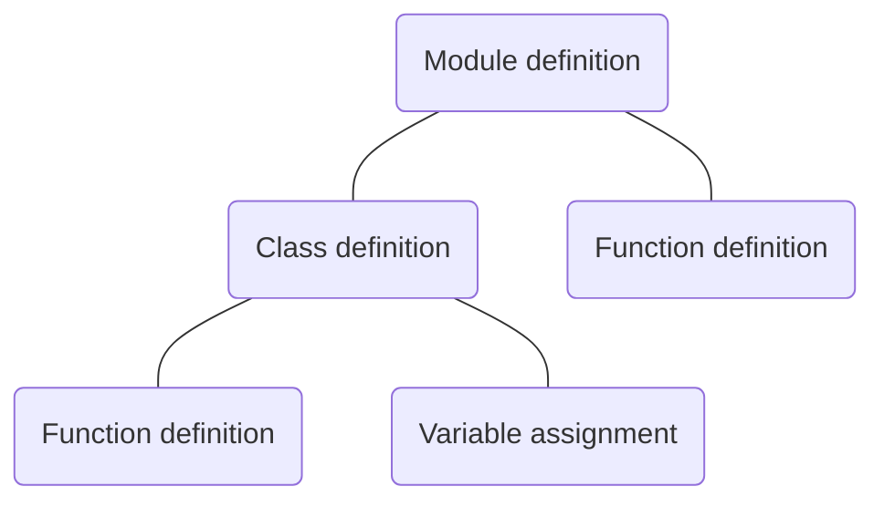
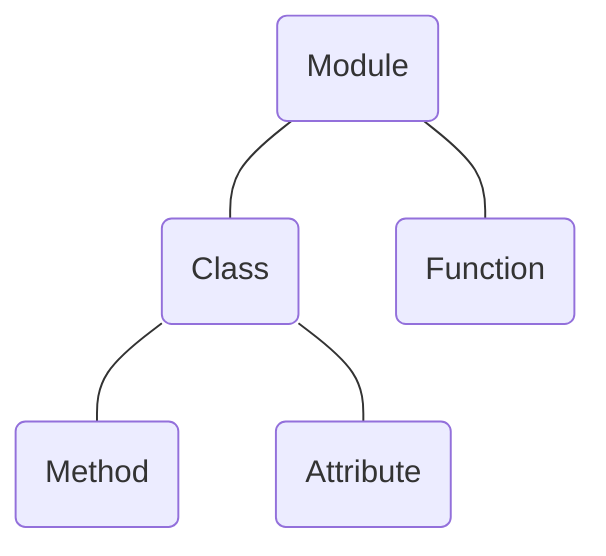

# Extending APIs

Griffe has an extension system that can be used to enhance or customize the data that Griffe collects. Extensions are written in Python.

## Using extensions

Extensions can be specified both on the command-line (in the terminal), and programmatically (in Python).

### On the command-line

On the command-line, you can specify extensions to use with the `-e`, `--extensions` option. This option accepts a single positional argument which can take two forms:

- a comma-separated list of extensions
- a JSON list of extensions

Extensions can accept options: the comma-separated list does not allow to specify options, while the JSON list does. See examples below.

With both forms, each extension refers to one of these three things:

- the name of a built-in extension's module, for example `dynamic_docstrings` (this is just an example, this built-in extension does not exist)
- the Python dotted-path to a module containing one or more extensions, or to an extension directly, for example `package.module` and `package.module.ThisExtension`
- the file path to a Python script, and an optional extension name, separated by a colon, for example `scripts/griffe_exts.py` and `scripts/griffe_exts.py:ThisExtension`

The specified extension modules can contain more than one extension: Griffe will pick up and load every extension declared or imported within the modules. If options are specified for a module that contains multiple extensions, the same options will be passed to all the extensions, so extension writers must make sure that all extensions within a single module accept the same options. If they don't, Griffe will abort with an error.

To specify options in the JSON form, use a dictionary instead of a string: the dictionary's only key is the extension identifier (built-in name, Python path, file path) and its value is a dictionary of options.

Some examples:

```bash
griffe dump griffe -e pydantic,scripts/exts.py:DynamicDocstrings,griffe_attrs
```

```bash
griffe check --search src griffe -e '[
  {"pydantic": {"schema": true}},
  {
    "scripts/exts.py:DynamicDocstrings": {
      "paths": ["mypkg.mymod.myobj"]
    }
  },
  "griffe_attrs"
]'
```

In the above two examples, `pydantic` would be a built-in extension, `scripts/exts.py:DynamicDocstrings` the file path plus name of a local extension, and `griffe_attrs` the name of a third-party package that exposes one or more extensions.

### Programmatically

Within Python code, extensions can be specified with the `extensions` parameter of the [`GriffeLoader` class][griffe.GriffeLoader] or [`load` function][griffe.load].

The parameter accepts an instance of the [`Extensions` class][griffe.Extensions]. Such an instance is created with the help of the [`load_extensions` function][griffe.load_extensions], which itself accepts a list of strings, dictionaries, extension classes and extension instances.

Strings and dictionaries are used the same way as [on the command-line](#on-the-command-line). Extension instances are used as such, and extension classes are instantiated without any options.

Example:

```python
import griffe

from mypackage.extensions import ThisExtension, ThisOtherExtension

extensions = griffe.load_extensions(
    {"pydantic": {"schema": true}},
    {"scripts/exts.py:DynamicDocstrings": {"paths": ["mypkg.mymod.myobj"]}},
    "griffe_attrs",
    ThisExtension(option="value"),
    ThisOtherExtension,
)

data = griffe.load("mypackage", extensions=extensions)
```

### In MkDocs

MkDocs and its mkdocstrings plugin can be configured to use Griffe extensions:

```yaml title="mkdocs.yml"
plugins:
- mkdocstrings:
    handlers:
      python:
        options:
          extensions:
          - pydantic: {schema: true}
          - scripts/exts.py:DynamicDocstrings:
              paths: [mypkg.mymod.myobj]
          - griffe_attrs
```

The `extensions` key accepts a list that is passed to the [`load_extensions` function][griffe.load_extensions]. See [how to use extensions programmatically](#programmatically) to learn more.

## Writing extensions

In the next section we give a bit of context on how Griffe works, to show how extensions can integrate into the data collection process. Feel free to skip to the [Events and hooks](#events-and-hooks) section or the [Full example](#full-example) section if you'd prefer to see concrete examples first.

### How it works

To extract information from your Python sources, Griffe tries to build Abstract Syntax Trees by parsing the sources with [`ast`][] utilities.

If the source code is not available (the modules are built-in or compiled), Griffe imports the modules and builds object trees instead.

Griffe then follows the [Visitor pattern](https://www.wikiwand.com/en/Visitor_pattern) to walk the tree and extract information. For ASTs, Griffe uses its [Visitor agent][griffe.Visitor] and for object trees, it uses its [Inspector agent][griffe.Inspector].

Sometimes during the walk through the tree (depth-first order), both the visitor and inspector agents will trigger events. These events can be hooked on by extensions to alter or enhance Griffe's behavior. Some hooks will be passed just the current node being visited, others will be passed both the node and an instance of an [Object][griffe.Object] subclass, such as a [Module][griffe.Module], a [Class][griffe.Class], a [Function][griffe.Function], or an [Attribute][griffe.Attribute]. Extensions will therefore be able to modify these instances.

The following flow chart shows an example of an AST visit. The tree is simplified: actual trees have a lot more nodes like `if/elif/else` nodes, `try/except/else/finally` nodes, [and many more][ast.AST].



The following flow chart shows an example of an object tree inspection. The tree is simplified as well: [many more types of objects are handled][griffe.ObjectKind].



For a more concrete example, let say that we visit (or inspect) an AST (or object tree) for a given module, and that this module contains a single class, which itself contains a single method:

- the agent (visitor or inspector) will walk through the tree by starting with the module node
- it will instantiate a [Module][griffe.Module], then walk through its members, continuing with the class node
- it will instantiate a [Class][griffe.Class], then walk through its members, continuing with the function node
- it will instantiate a [Function][griffe.Function]
- then it will go back up and finish walking since there are no more nodes to walk through

Every time the agent enters a node, creates an object instance, or finish handling members of an object, it will trigger an event.

The flow of events is drawn in the following flowchart:

```mermaid
flowchart TB
visit_mod{{enter module node}}
event_mod_node{{"<a href='/griffe/reference/griffe/extensions/#griffe.Extension.on_node'><b><code style='color: var(--md-accent-fg-color)'>on_node</code></b></a> event<br><a href='/griffe/reference/griffe/extensions/#griffe.Extension.on_module_node'><b><code style='color: var(--md-accent-fg-color)'>on_module_node</code></b></a> event"}}
create_mod{{create module instance}}
event_mod_instance{{"<a href='/griffe/reference/griffe/extensions/#griffe.Extension.on_instance'><b><code style='color: var(--md-accent-fg-color)'>on_instance</code></b></a> event<br><a href='/griffe/reference/griffe/extensions/#griffe.Extension.on_module_instance'><b><code style='color: var(--md-accent-fg-color)'>on_module_instance</code></b></a> event"}}
visit_mod_members{{visit module members}}
visit_cls{{enter class node}}
event_cls_node{{"<a href='/griffe/reference/griffe/extensions/#griffe.Extension.on_node'><b><code style='color: var(--md-accent-fg-color)'>on_node</code></b></a> event<br><a href='/griffe/reference/griffe/extensions/#griffe.Extension.on_class_node'><b><code style='color: var(--md-accent-fg-color)'>on_class_node</code></b></a> event"}}
create_cls{{create class instance}}
event_cls_instance{{"<a href='/griffe/reference/griffe/extensions/#griffe.Extension.on_instance'><b><code style='color: var(--md-accent-fg-color)'>on_instance</code></b></a> event<br><a href='/griffe/reference/griffe/extensions/#griffe.Extension.on_class_instance'><b><code style='color: var(--md-accent-fg-color)'>on_class_instance</code></b></a> event"}}
visit_cls_members{{visit class members}}
visit_func{{enter func node}}
event_func_node{{"<a href='/griffe/reference/griffe/extensions/#griffe.Extension.on_node'><b><code style='color: var(--md-accent-fg-color)'>on_node</code></b></a> event<br><a href='/griffe/reference/griffe/extensions/#griffe.Extension.on_function_node'><b><code style='color: var(--md-accent-fg-color)'>on_function_node</code></b></a> event"}}
create_func{{create function instance}}
event_func_instance{{"<a href='/griffe/reference/griffe/extensions/#griffe.Extension.on_instance'><b><code style='color: var(--md-accent-fg-color)'>on_instance</code></b></a> event<br><a href='/griffe/reference/griffe/extensions/#griffe.Extension.on_function_instance'><b><code style='color: var(--md-accent-fg-color)'>on_function_instance</code></b></a> event"}}
event_cls_members{{"<a href='/griffe/reference/griffe/extensions/#griffe.Extension.on_members'><b><code style='color: var(--md-accent-fg-color)'>on_members</code></b></a> event<br><a href='/griffe/reference/griffe/extensions/#griffe.Extension.on_class_members'><b><code style='color: var(--md-accent-fg-color)'>on_class_members</code></b></a> event"}}
event_mod_members{{"<a href='/griffe/reference/griffe/extensions/#griffe.Extension.on_members'><b><code style='color: var(--md-accent-fg-color)'>on_members</code></b></a> event<br><a href='/griffe/reference/griffe/extensions/#griffe.Extension.on_module_members'><b><code style='color: var(--md-accent-fg-color)'>on_module_members</code></b></a> event"}}

start{start} --> visit_mod
visit_mod --> event_mod_node
event_mod_node --> create_mod
create_mod --> event_mod_instance
event_mod_instance --> visit_mod_members
visit_mod_members --1--> visit_cls
visit_cls --> event_cls_node
event_cls_node --> create_cls
create_cls --> event_cls_instance
event_cls_instance --> visit_cls_members
visit_cls_members --1--> visit_func
visit_func --> event_func_node
event_func_node --> create_func
create_func --> event_func_instance
event_func_instance --> visit_cls_members
visit_cls_members --2--> event_cls_members
event_cls_members --> visit_mod_members
visit_mod_members --2--> event_mod_members
event_mod_members --> finish{finish}

class event_mod_node event
class event_mod_instance event
class event_cls_node event
class event_cls_instance event
class event_func_node event
class event_func_instance event
class event_cls_members event
class event_mod_members event
classDef event stroke:#3cc,stroke-width:2
```



Hopefully this flowchart gave you a pretty good idea of what happens when Griffe collects data from a Python module. The next section will explain in more details the different events that are triggered, and how to hook onto them in your extensions.

### Events and hooks

There are two kinds of events in Griffe: **load events** and **analysis events**. Load events are scoped to the Griffe loader. Analysis events are scoped to the visitor and inspector agents (triggered during static and dynamic analysis).

#### Load events

There are two **load events**:

- [`on_package_loaded`][griffe.Extension.on_package_loaded]: The "on package loaded" event is triggered when the loader has finished loading a package entirely, i.e. when all its submodules were scanned and loaded. This event can be hooked by extensions which require the whole package to be loaded, to be able to navigate the object tree without raising lookup errors or alias resolution errors.
- [`on_wildcard_expansion`][griffe.Extension.on_wildcard_expansion]: The "on wildcard expansion" event is triggered for each alias that is created by expanding wildcard imports (`from ... import *`).

#### Analysis events

There are 3 generic **analysis events**:

- [`on_node`][griffe.Extension.on_node]: The "on node" events are triggered when the agent (visitor or inspector) starts handling a node in the tree (AST or object tree).
- [`on_instance`][griffe.Extension.on_instance]: The "on instance" events are triggered when the agent just created an instance of [Module][griffe.Module], [Class][griffe.Class], [Function][griffe.Function], or [Attribute][griffe.Attribute], and added it as a member of its parent. The "on instance" event is **not** triggered when an [Alias][griffe.Alias] is created.
- [`on_members`][griffe.Extension.on_members]: The "on members" events are triggered when the agent just finished handling all the members of an object. Functions and attributes do not have members, so there are no "on members" event for these two kinds.

There are also specific **analysis events** for each object kind:

- [`on_module_node`][griffe.Extension.on_module_node]
- [`on_module_instance`][griffe.Extension.on_module_instance]
- [`on_module_members`][griffe.Extension.on_module_members]
- [`on_class_node`][griffe.Extension.on_class_node]
- [`on_class_instance`][griffe.Extension.on_class_instance]
- [`on_class_members`][griffe.Extension.on_class_members]
- [`on_function_node`][griffe.Extension.on_function_node]
- [`on_function_instance`][griffe.Extension.on_function_instance]
- [`on_attribute_node`][griffe.Extension.on_attribute_node]
- [`on_attribute_instance`][griffe.Extension.on_attribute_instance]

And a special event for aliases:

- [`on_alias`][griffe.Extension.on_alias]: The "on alias" event is triggered when an [Alias][griffe.Alias] was just created and added as a member of its parent object.

---

**Hooks** are methods that are called when a particular event is triggered. To target a specific event, the hook must be named after it.

**Extensions** are classes that inherit from [Griffe's Extension base class][griffe.Extension] and define some hooks as methods:

```python
import ast
import griffe


class MyExtension(griffe.Extension):
    def on_instance(
        self,
        node: ast.AST | griffe.ObjectNode,
        obj: griffe.Object,
        agent: griffe.Visitor | griffe.Inspector,
        **kwargs,
    ) -> None:
        """Do something with `node` and/or `obj`."""
```

Hooks are always defined as methods of a class inheriting from [Extension][griffe.Extension], never as standalone functions. IDEs should autocomplete the signature when you start typing `def` followed by a hook name.

Since hooks are declared in a class, feel free to also declare state variables (or any other variable) in the `__init__` method:

```python
import ast
from griffe import Extension, Object, ObjectNode


class MyExtension(Extension):
    def __init__(self) -> None:
        super().__init__()
        self.state_thingy = "initial stuff"
        self.list_of_things = []

    def on_instance(
        self,
        node: ast.AST | griffe.ObjectNode,
        obj: griffe.Object,
        agent: griffe.Visitor | griffe.Inspector,
        **kwargs,
    ) -> None:
        """Do something with `node` and/or `obj`."""
```

### Static/dynamic support

Extensions can support both static and dynamic analysis of modules. If a module is scanned statically, your extension hooks will receive AST nodes (from the [ast][] module of the standard library). If the module is scanned dynamically, your extension hooks will receive [object nodes][griffe.ObjectNode]. Similarly, your hooks will receive a reference to the analysis agent that calls them, either a [Visitor][griffe.Visitor] or an [Inspector][griffe.Inspector].

To support static analysis, dynamic analysis, or both, you can therefore check the type of the received node or agent:

```python
import ast
import griffe


class MyExtension(griffe.Extension):
    def on_instance(
        self,
        node: ast.AST | griffe.ObjectNode,
        obj: griffe.Object,
        agent: griffe.Visitor | griffe.Inspector,
        **kwargs,
    ) -> None:
        """Do something with `node` and/or `obj`."""
        if isinstance(node, ast.AST):
            ...  # Apply logic for static analysis.
        else:
            ...  # Apply logic for dynamic analysis.
```

```python
import ast
import griffe


class MyExtension(Extension):
    def on_instance(
        self,
        node: ast.AST | griffe.ObjectNode,
        obj: griffe.Object,
        agent: griffe.Visitor | griffe.Inspector,
        **kwargs,
    ) -> None:
        """Do something with `node` and/or `obj`."""
        if isinstance(agent, griffe.Visitor):
            ...  # Apply logic for static analysis.
        else:
            ...  # Apply logic for dynamic analysis.
```

The preferred method is to check the type of the received node rather than the agent.

Since hooks also receive instantiated modules, classes, functions and attributes, most of the time you will not need to use the `node` argument other than for checking its type and deciding what to do based on the result. And since we always add `**kwargs` to the hooks' signatures, you can drop any parameter you don't use from the signature:

```python
import griffe


class MyExtension(Extension):
    def on_instance(self, obj: griffe.Object, **kwargs) -> None:
        """Do something with `obj`."""
        ...
```

### Visiting trees

Extensions provide basic functionality to help you visit trees:

- [`visit`][griffe.Extension.visit]: call `self.visit(node)` to start visiting an abstract syntax tree.
- [`generic_visit`][griffe.Extension.generic_visit]: call `self.generic_visit(node)` to visit each subnode of a given node.
- [`inspect`][griffe.Extension.inspect]: call `self.inspect(node)` to start visiting an object tree. Nodes contain references to the runtime objects, see [`ObjectNode`][griffe.ObjectNode].
- [`generic_inspect`][griffe.Extension.generic_inspect]: call `self.generic_inspect(node)` to visit each subnode of a given node.

Calling `self.visit(node)` or `self.inspect(node)` will do nothing unless you actually implement methods that handle specific types of nodes:

- for ASTs, methods must be named `visit_<node_type>` where `<node_type>` is replaced with the lowercase name of the node's class. For example, to allow visiting [`ClassDef`][ast.ClassDef] nodes, you must implement the `visit_classdef` method:

    ```python
    import ast
    from griffe import Extension


    class MyExtension(Extension):
        def visit_classdef(node: ast.ClassDef) -> None:
            # Do something with the node...
            ...
            # ...then visit the subnodes
            # (it only makes sense if you implement other methods
            # such as visit_functiondef or visit_assign for example).
            self.generic_visit(node)
    ```

    See the [list of existing AST classes](#ast-nodes) to learn what method you can implement.

- for object trees, methods must be named `inspect_<node_type>`, where `<node_type>` is replaced with the string value of the node's kind. The different kinds are listed in the [`ObjectKind`][griffe.ObjectKind] enumeration. For example, to allow inspecting coroutine nodes, you must implement the `inspect_coroutine` method:

    ```python
    from griffe import Extension, ObjectNode


    class MyExtension(Extension):
        def inspect_coroutine(node: ObjectNode) -> None:
            # Do something with the node...
            ...
            # ...then visit the subnodes if it makes sense.
            self.generic_inspect(node)
    ```

### Triggering other extensions

If your extension creates new objects, you might want to trigger the other enabled extensions on these object instances. To do this you can use [`agent.extensions.call`][griffe.Extensions.call]:

```python
import ast
import griffe


class MyExtension(griffe.Extension):
    def on_node(self, node: ast.AST | griffe.ObjectNode, agent: griffe.Visitor | griffe.Inspector, **kwargs) -> None:
        # New object created for whatever reason.
        function = griffe.Function(...)

        # Trigger other extensions.
        agent.extensions.call("on_function_instance", node=node, agent=agent, func=function, **kwargs)
```

### Extra data

All Griffe objects (modules, classes, functions, attributes) can store additional (meta)data in their `extra` attribute. This attribute is a dictionary of dictionaries. The first layer is used as namespacing: each extension writes into its own namespace, or integrates with other projects by reading/writing in their namespaces, according to what they support and document.

```python
import griffe

self_namespace = "my_extension"


class MyExtension(griffe.Extension):
    def on_instance(self, obj: griffe.Object, **kwargs) -> None:
        obj.extra[self_namespace]["some_key"] = "some_value"
```

For example, [mkdocstrings-python](https://mkdocstrings.github.io/python) looks into the `mkdocstrings` namespace for a `template` key. Extensions can therefore provide a custom template value by writing into `extra["mkdocstrings"]["template"]`:

```python
import griffe

self_namespace = "my_extension"
mkdocstrings_namespace = "mkdocstrings"


class MyExtension(griffe.Extension):
    def on_class_instance(self, cls: griffe.Class, **kwargs) -> None:
        obj.extra[mkdocstrings_namespace]["template"] = "my_custom_template"
```

[Read more about mkdocstrings handler extensions.](https://mkdocstrings.github.io/usage/handlers/#handler-extensions)

### Options

Extensions can be made to support options. These options can then be passed from the [command-line](#on-the-command-line) using JSON, from Python directly, or from other tools like MkDocs, in `mkdocs.yml`.

```python
import griffe


class MyExtension(griffe.Extension):
    def __init__(self, option1: str, option2: bool = False) -> None:
        super().__init__()
        self.option1 = option1
        self.option2 = option2

    def on_attribute_instance(self, attr: griffe.Attribute, **kwargs) -> None:
        if self.option2:
            ...  # Do something.
```

### Logging

To better integrate with Griffe and other tools in the ecosystem (notably MkDocs), use Griffe loggers to log messages:

```python
import griffe

logger = griffe.get_logger(__name__)


class MyExtension(griffe.Extension):
    def on_module_members(self, mod: griffe.Module, **kwargs) -> None:
        logger.info("Doing some work on module %s and its members", mod.path)
```

### Full example

The following example shows how one could write a "dynamic docstrings" extension that dynamically import objects that declare their docstrings dynamically, to improve support for such docstrings. The extension is configurable to run only on user-selected objects.

Package structure (or just write your extension in a local script):

```tree
./
    pyproject.toml
    src/
        dynamic_docstrings/
            __init__.py
            extension.py
```

```python title="./src/dynamic_docstrings/extension.py"
import ast
import inspect
import griffe

logger = griffe.get_logger(__name__)


class DynamicDocstrings(griffe.Extension):
    def __init__(self, object_paths: list[str] | None = None) -> None:
        self.object_paths = object_paths

    def on_instance(
        self,
        node: ast.AST | griffe.ObjectNode,
        obj: griffe.Object,
        agent: griffe.Visitor | griffe.Inspector,
        **kwargs,
    ) -> None:
        if isinstance(node, griffe.ObjectNode):
            return  # Skip runtime objects, their docstrings are already right.

        if self.object_paths and obj.path not in self.object_paths:
            return  # Skip objects that were not selected.

        # Import object to get its evaluated docstring.
        try:
            runtime_obj = griffe.dynamic_import(obj.path)
            docstring = runtime_obj.__doc__
        except ImportError:
            logger.debug(f"Could not get dynamic docstring for {obj.path}")
            return
        except AttributeError:
            logger.debug(f"Object {obj.path} does not have a __doc__ attribute")
            return

        # Update the object instance with the evaluated docstring.
        docstring = inspect.cleandoc(docstring)
        if obj.docstring:
            obj.docstring.value = docstring
        else:
            obj.docstring = griffe.Docstring(
                docstring,
                parent=obj,
                docstring_parser=agent.docstring_parser,
                docstring_options=agent.docstring_options,
            )
```

You can then expose this extension in the top-level module of your package:

```python title="./src/dynamic_docstrings/__init__.py"
from dynamic_docstrings.extension import DynamicDocstrings

__all__ = ["DynamicDocstrings"]
```

This will allow users to load and use this extension by referring to it as `dynamic_docstrings` (your Python package name).

See [how to use extensions](#using-extensions) to learn more about how to load and use your new extension.

## AST nodes

> <table style="border: none; background-color: unset;"><tbody><tr><td>
>
> - [`Add`][ast.Add]
> - [`alias`][ast.alias]
> - [`And`][ast.And]
> - [`AnnAssign`][ast.AnnAssign]
> - [`arg`][ast.arg]
> - [`arguments`][ast.arguments]
> - [`Assert`][ast.Assert]
> - [`Assign`][ast.Assign]
> - [`AsyncFor`][ast.AsyncFor]
> - [`AsyncFunctionDef`][ast.AsyncFunctionDef]
> - [`AsyncWith`][ast.AsyncWith]
> - [`Attribute`][ast.Attribute]
> - [`AugAssign`][ast.AugAssign]
> - [`Await`][ast.Await]
> - [`BinOp`][ast.BinOp]
> - [`BitAnd`][ast.BitAnd]
> - [`BitOr`][ast.BitOr]
> - [`BitXor`][ast.BitXor]
> - [`BoolOp`][ast.BoolOp]
> - [`Break`][ast.Break]
> - `Bytes`[^1]
> - [`Call`][ast.Call]
> - [`ClassDef`][ast.ClassDef]
> - [`Compare`][ast.Compare]
> - [`comprehension`][ast.comprehension]
> - [`Constant`][ast.Constant]
> - [`Continue`][ast.Continue]
> - [`Del`][ast.Del]
> - [`Delete`][ast.Delete]
>
> </td><td>
>
> - [`Dict`][ast.Dict]
> - [`DictComp`][ast.DictComp]
> - [`Div`][ast.Div]
> - `Ellipsis`[^1]
> - [`Eq`][ast.Eq]
> - [`ExceptHandler`][ast.ExceptHandler]
> - [`Expr`][ast.Expr]
> - `Expression`[^1]
> - `ExtSlice`[^2]
> - [`FloorDiv`][ast.FloorDiv]
> - [`For`][ast.For]
> - [`FormattedValue`][ast.FormattedValue]
> - [`FunctionDef`][ast.FunctionDef]
> - [`GeneratorExp`][ast.GeneratorExp]
> - [`Global`][ast.Global]
> - [`Gt`][ast.Gt]
> - [`GtE`][ast.GtE]
> - [`If`][ast.If]
> - [`IfExp`][ast.IfExp]
> - [`Import`][ast.Import]
> - [`ImportFrom`][ast.ImportFrom]
> - [`In`][ast.In]
> - `Index`[^2]
> - `Interactive`[^3]
> - [`Invert`][ast.Invert]
> - [`Is`][ast.Is]
> - [`IsNot`][ast.IsNot]
> - [`JoinedStr`][ast.JoinedStr]
> - [`keyword`][ast.keyword]
>
> </td><td>
>
> - [`Lambda`][ast.Lambda]
> - [`List`][ast.List]
> - [`ListComp`][ast.ListComp]
> - [`Load`][ast.Load]
> - [`LShift`][ast.LShift]
> - [`Lt`][ast.Lt]
> - [`LtE`][ast.LtE]
> - [`Match`][ast.Match]
> - [`MatchAs`][ast.MatchAs]
> - [`match_case`][ast.match_case]
> - [`MatchClass`][ast.MatchClass]
> - [`MatchMapping`][ast.MatchMapping]
> - [`MatchOr`][ast.MatchOr]
> - [`MatchSequence`][ast.MatchSequence]
> - [`MatchSingleton`][ast.MatchSingleton]
> - [`MatchStar`][ast.MatchStar]
> - [`MatchValue`][ast.MatchValue]
> - [`MatMult`][ast.MatMult]
> - [`Mod`][ast.Mod]
> - `Module`[^3]
> - [`Mult`][ast.Mult]
> - [`Name`][ast.Name]
> - `NameConstant`[^1]
> - [`NamedExpr`][ast.NamedExpr]
> - [`Nonlocal`][ast.Nonlocal]
> - [`Not`][ast.Not]
> - [`NotEq`][ast.NotEq]
> - [`NotIn`][ast.NotIn]
> - `Num`[^1]
>
> </td><td>
>
> - [`Or`][ast.Or]
> - [`Pass`][ast.Pass]
> - `pattern`[^3]
> - [`Pow`][ast.Pow]
> - `Print`[^4]
> - [`Raise`][ast.Raise]
> - [`Return`][ast.Return]
> - [`RShift`][ast.RShift]
> - [`Set`][ast.Set]
> - [`SetComp`][ast.SetComp]
> - [`Slice`][ast.Slice]
> - [`Starred`][ast.Starred]
> - [`Store`][ast.Store]
> - `Str`[^1]
> - [`Sub`][ast.Sub]
> - [`Subscript`][ast.Subscript]
> - [`Try`][ast.Try]
> - `TryExcept`[^5]
> - `TryFinally`[^6]
> - [`Tuple`][ast.Tuple]
> - [`UAdd`][ast.UAdd]
> - [`UnaryOp`][ast.UnaryOp]
> - [`USub`][ast.USub]
> - [`While`][ast.While]
> - [`With`][ast.With]
> - [`withitem`][ast.withitem]
> - [`Yield`][ast.Yield]
> - [`YieldFrom`][ast.YieldFrom]
>
> </td></tr></tbody></table>

[^1]: Deprecated since Python 3.8.
[^2]: Deprecated since Python 3.9.
[^3]: Not documented.
[^4]: `print` became a builtin (instead of a keyword) in Python 3.
[^5]: Now `ExceptHandler`, in the `handlers` attribute of `Try` nodes.
[^6]: Now a list of expressions in the `finalbody` attribute of `Try` nodes.


## Next steps

Extensions are a powerful mechanism to customize or enhance the data loaded by Griffe. But sometimes, all you need to do to improve the data is to make Griffe happy by following a few conventions. We therefore invite you to read our recommendations on [public APIs](recommendations/public-apis.md), [Python code best practices](recommendations/python-code.md) and [docstrings](recommendations/docstrings.md).
